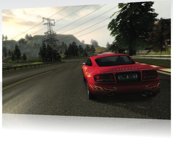

## Note from 2022: this is a tutorial from 2010, for Unity v3
It **will not work** "as is" in modern versions of Unity. I've uploaded here to make it accessible
I've included the extracted source files and run a pdf to html converter on the tutorial files to allow them to be readable and accessible here. Enjoy!

# Car Tutorial (Unity v3 - 2010)

###Learn how to create an arcade style race car set-up.   
 
[CarTutorial.zip](https://web.archive.org/web/20120329194848if_/http://download.unity3d.com/support/resources/files/CarTutorial.zip) 212.0M   

This in-depth tutorial written by Morten Sommer, with graphics and coding by Unity Studios, will take you through all the necessary steps to create a fun arcade style race car mechanic.

### Section 1 - Assembling the Car
[CarTutorialSection_1.pdf](Source/CarTutorialSection_1.pdf) (3.4M) [or html](Docs/CarTutorialSection_1.html)  
How to assemble a Car Prefab from a 3D model, scripts and components.
### Section 2 - Tweaking the Car
[CarTutorialSection_2.pdf](Source/CarTutorialSection_2.pdf) (2.6M) [or html](Docs/CarTutorialSection_2.html) 
How to tweak the car to behave "better" or in different ways.
### Section 3 - Under the Hood
[CarTutorialSection_3.pdf](Source/CarTutorialSection_3.pdf) (5.2M) [or html](Docs/CarTutorialSection_3.html)
A more in-depth look at the actual code that drives the car. 

The tutorial project also includes a high-end physically accurate and realistic car model created by [Jonas Echterhoff](https://twitter.com/jonasechterhoff). Use this if you want to make more simulation-like games.
